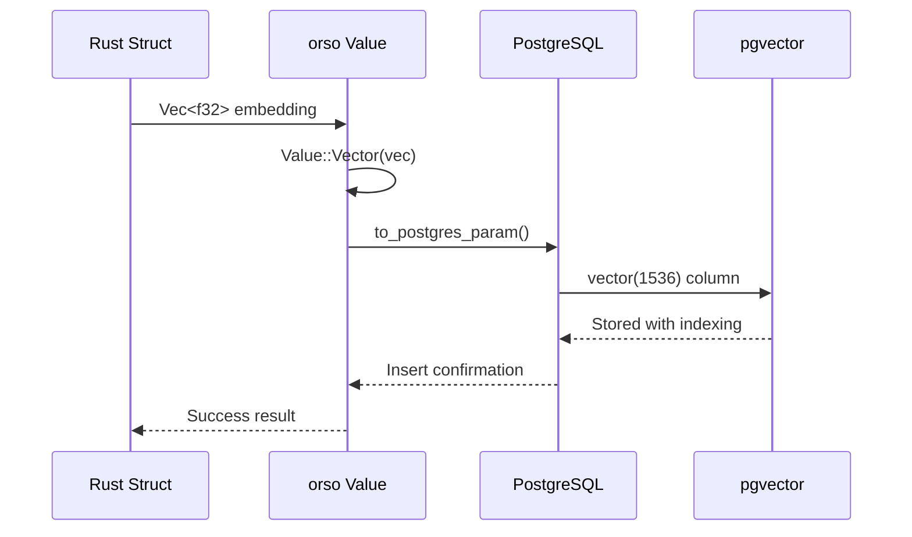

# **Vector Implementation in orso-postgres**
## **Complete Technical Explanation with Diagrams**

---

## **🎯 Overview: How Vectors Flow Through orso-postgres**

```mermaid
graph TD
    A[Rust Struct with Vec<f32>] --> B[orso-postgres Value::Vector]
    B --> C[PostgreSQL vector(N) Column]
    C --> D[pgvector Extension Processing]
    D --> E[Vector Similarity Search]
    E --> F[Ranked Results Back to Rust]

    style A fill:#e1f5fe
    style B fill:#f3e5f5
    style C fill:#e8f5e8
    style D fill:#fff3e0
    style E fill:#fce4ec
    style F fill:#e1f5fe
```

---

## **1️⃣ Data Structure Layer**

### **Current State (Without Vectors)**
```rust
// types.rs - Current Value enum
#[derive(Debug, Clone, Serialize, Deserialize, PartialEq)]
pub enum Value {
    Null,
    Integer(i64),
    Real(f64),
    Text(String),
    Blob(Vec<u8>),
    Boolean(bool),
    DateTime(OrsoDateTime),
    IntegerArray(Vec<i32>),
    BigIntArray(Vec<i64>),
    NumericArray(Vec<f64>),
}
```

### **Enhanced State (With Vectors)**
```rust
// types.rs - Enhanced Value enum (+1 line)
#[derive(Debug, Clone, Serialize, Deserialize, PartialEq)]
pub enum Value {
    Null,
    Integer(i64),
    Real(f64),
    Text(String),
    Blob(Vec<u8>),
    Boolean(bool),
    DateTime(OrsoDateTime),
    IntegerArray(Vec<i32>),
    BigIntArray(Vec<i64>),
    NumericArray(Vec<f64>),
    Vector(Vec<f32>),  // 🆕 NEW: Vector support
}
```

**Diagram: Value Type Hierarchy**
```
Value Enum
├── Scalar Types
│   ├── Null
│   ├── Integer(i64)
│   ├── Real(f64)
│   ├── Text(String)
│   ├── Boolean(bool)
│   └── DateTime(OrsoDateTime)
├── Array Types (PostgreSQL Native)
│   ├── IntegerArray(Vec<i32>)
│   ├── BigIntArray(Vec<i64>)
│   └── NumericArray(Vec<f64>)
├── Binary Types
│   └── Blob(Vec<u8>)
└── Vector Types 🆕
    └── Vector(Vec<f32>)  ← Embeddings
```

---

## **2️⃣ Schema Definition Layer**

### **Rust Struct Definition**
```rust
use orso_postgres::{Orso, Serialize, Deserialize};

#[derive(Orso, Serialize, Deserialize)]
#[orso_table("documents")]
struct Document {
    #[orso_column(primary_key)]
    id: Option<String>,

    title: String,
    content: String,

    // 🆕 Vector field with dimension specification
    #[orso_column(vector(1536))]  // OpenAI ada-002 embedding size
    content_embedding: Vec<f32>,

    #[orso_column(vector(768))]   // Sentence transformers size
    title_embedding: Vec<f32>,
}
```

### **Generated PostgreSQL Schema**
```sql
CREATE TABLE documents (
    id TEXT PRIMARY KEY DEFAULT gen_random_uuid(),
    title TEXT NOT NULL,
    content TEXT NOT NULL,
    content_embedding vector(1536) NOT NULL,  -- pgvector type
    title_embedding vector(768) NOT NULL      -- pgvector type
);

-- Automatic index creation for performance
CREATE INDEX ON documents USING hnsw (content_embedding vector_cosine_ops);
CREATE INDEX ON documents USING hnsw (title_embedding vector_cosine_ops);
```

**Diagram: Schema Generation Flow**
```mermaid
graph LR
    A[#[orso_column(vector(1536))]] --> B[Macro Parser]
    B --> C[SQL Type: vector(1536)]
    C --> D[FieldType::Vector]
    D --> E[Index: HNSW]

    style A fill:#e3f2fd
    style B fill:#f3e5f5
    style C fill:#e8f5e8
    style D fill:#fff3e0
    style E fill:#fce4ec
```

---

## **3️⃣ Data Conversion Layer**

### **Rust ↔ PostgreSQL Type Mapping**

```rust
impl Value {
    // Convert orso Value to PostgreSQL parameter
    pub fn to_postgres_param(&self) -> Box<dyn ToSql + Send + Sync> {
        match self {
            Value::Vector(v) => {
                // Convert Vec<f32> to PostgreSQL vector type
                Box::new(v.clone())  // pgvector handles Vec<f32> natively
            }
            // ... other types unchanged
        }
    }

    // Convert PostgreSQL row data back to orso Value
    pub fn from_postgres_row(row: &Row, idx: usize) -> Result<Self> {
        let column = &row.columns()[idx];
        match column.type_().name() {
            "vector" => {
                let val: Option<Vec<f32>> = row.try_get(idx)?;
                Ok(val.map(Value::Vector).unwrap_or(Value::Null))
            }
            // ... other types unchanged
        }
    }
}
```

**Diagram: Data Flow During Insert**


---

## **4️⃣ Query Interface Layer**

### **Vector Similarity Search**
```rust
impl Document {
    // Basic vector search
    pub async fn find_similar(
        embedding: &[f32],
        limit: u32,
        db: &Database
    ) -> Result<Vec<Self>> {
        Self::query()
            .vector_search("content_embedding", embedding, limit)
            .execute(db).await
    }

    // Advanced hybrid search (text + vector)
    pub async fn hybrid_search(
        text_query: &str,
        embedding: &[f32],
        db: &Database
    ) -> Result<Vec<Self>> {
        Self::query()
            .search("content", text_query)           // Text search
            .vector_similar("content_embedding", embedding, Some(0.8))  // Vector similarity
            .limit(20)
            .execute(db).await
    }
}
```

### **Generated SQL Examples**
```sql
-- Basic vector similarity search
SELECT * FROM documents
ORDER BY content_embedding <-> '[0.1,0.2,0.3,...]'::vector
LIMIT 10;

-- Hybrid search (text + vector)
SELECT * FROM documents
WHERE content LIKE '%AI research%'
  AND content_embedding <-> '[0.1,0.2,0.3,...]'::vector < 0.8
ORDER BY content_embedding <-> '[0.1,0.2,0.3,...]'::vector
LIMIT 20;

-- Multiple vector search (title and content)
SELECT *,
       title_embedding <-> '[...]'::vector as title_similarity,
       content_embedding <-> '[...]'::vector as content_similarity
FROM documents
ORDER BY (title_embedding <-> '[...]'::vector + content_embedding <-> '[...]'::vector) / 2
LIMIT 10;
```

**Diagram: Vector Search Flow**
```mermaid
graph TD
    A[Query Vector: Vec<f32>] --> B[QueryBuilder.vector_search()]
    B --> C[SQL Generation with <-> operator]
    C --> D[PostgreSQL + pgvector]
    D --> E[HNSW Index Lookup]
    E --> F[Cosine Distance Calculation]
    F --> G[Ranked Results]
    G --> H[Row → Value → Rust Struct]

    style A fill:#e1f5fe
    style D fill:#e8f5e8
    style E fill:#fff3e0
    style F fill:#fce4ec
    style H fill:#e1f5fe
```

---

## **5️⃣ Vector Operations**

### **Distance Metrics Supported**
```rust
pub enum VectorDistance {
    Cosine,     // <-> (most common for embeddings)
    L2,         // <#> (euclidean distance)
    InnerProduct, // <#> (dot product)
}

impl QueryBuilder {
    pub fn vector_similar_with_distance(
        mut self,
        column: &str,
        vector: &[f32],
        distance: VectorDistance,
        threshold: f64
    ) -> Self {
        let operator = match distance {
            VectorDistance::Cosine => "<->",
            VectorDistance::L2 => "<#>",
            VectorDistance::InnerProduct => "<#>",
        };

        let condition = format!("{} {} '{}'::vector < {}",
                               column, operator, vector_to_string(vector), threshold);
        self.where_clauses.push(FilterOperator::Custom(condition));
        self
    }
}
```

### **Vector Index Types**
```sql
-- HNSW Index (default - best for most cases)
CREATE INDEX ON documents USING hnsw (embedding vector_cosine_ops);

-- IVFFlat Index (better for memory-constrained environments)
CREATE INDEX ON documents USING ivfflat (embedding vector_cosine_ops)
WITH (lists = 100);
```

**Diagram: Vector Index Performance**
```
Query Performance by Index Type:

HNSW (Hierarchical Navigable Small World)
├── Speed: ⭐⭐⭐⭐⭐ (Fastest queries)
├── Memory: ⭐⭐⭐ (Higher memory usage)
├── Build Time: ⭐⭐⭐ (Moderate)
└── Best For: Production systems, high QPS

IVFFlat (Inverted File with Flat Compression)
├── Speed: ⭐⭐⭐⭐ (Fast queries)
├── Memory: ⭐⭐⭐⭐⭐ (Lower memory usage)
├── Build Time: ⭐⭐⭐⭐ (Faster build)
└── Best For: Memory-constrained systems

No Index (Sequential Scan)
├── Speed: ⭐ (Very slow)
├── Memory: ⭐⭐⭐⭐⭐ (Minimal)
├── Build Time: ⭐⭐⭐⭐⭐ (None)
└── Best For: Development only
```

---

## **6️⃣ Complete Usage Example**

```rust
use orso_postgres::{Database, DatabaseConfig, Orso};

#[derive(Orso, Serialize, Deserialize)]
#[orso_table("documents")]
struct Document {
    #[orso_column(primary_key)]
    id: Option<String>,

    title: String,
    content: String,

    #[orso_column(vector(1536))]
    embedding: Vec<f32>,

    #[orso_column(created_at)]
    created_at: Option<OrsoDateTime>,
}

async fn vector_workflow_example() -> Result<()> {
    // 1. Setup database with pgvector
    let config = DatabaseConfig::postgres("postgresql://localhost/vectordb");
    let db = Database::init(config).await?;

    // 2. Run migrations (creates vector columns + indexes)
    Document::migrate(&db).await?;

    // 3. Insert documents with embeddings
    let doc = Document {
        id: None,
        title: "Machine Learning Paper".to_string(),
        content: "Deep learning approaches...".to_string(),
        embedding: get_embedding("Deep learning approaches...").await?, // OpenAI API call
        created_at: None,
    };
    doc.insert(&db).await?;

    // 4. Vector similarity search
    let query_embedding = get_embedding("neural networks").await?;
    let similar_docs = Document::query()
        .vector_search("embedding", &query_embedding, 10)
        .execute(&db).await?;

    println!("Found {} similar documents", similar_docs.len());

    // 5. Hybrid search (combine text and vector)
    let hybrid_results = Document::query()
        .search("content", "machine learning")
        .vector_similar("embedding", &query_embedding, Some(0.8))
        .order_by(Sort::new("created_at", SortOrder::Desc))
        .limit(5)
        .execute(&db).await?;

    Ok(())
}

// Helper function to generate embeddings (external API)
async fn get_embedding(text: &str) -> Result<Vec<f32>> {
    // Call OpenAI, Cohere, or local embedding model
    // Return 1536-dimensional vector for ada-002
    todo!("Integrate with embedding API")
}
```

**Diagram: Complete Workflow**
```mermaid
graph TD
    A[Text: "Deep learning approaches"] --> B[OpenAI API]
    B --> C[Vec<f32> 1536 dimensions]
    C --> D[orso Value::Vector]
    D --> E[PostgreSQL vector(1536)]
    E --> F[HNSW Index]

    G[Query: "neural networks"] --> H[OpenAI API]
    H --> I[Query Vector]
    I --> J[vector_search() SQL]
    J --> F
    F --> K[Cosine Similarity <->]
    K --> L[Ranked Results]
    L --> M[Rust Vec<Document>]

    style A fill:#e1f5fe
    style B fill:#f3e5f5
    style E fill:#e8f5e8
    style F fill:#fff3e0
    style K fill:#fce4ec
    style M fill:#e1f5fe
```

---

## **🎯 Key Advantages of This Design**

### **1. Type Safety**
```rust
// Compile-time dimension checking
#[orso_column(vector(1536))]
embedding: Vec<f32>,  // Must be exactly 1536 elements

// PostgreSQL enforces at runtime
INSERT INTO documents (embedding) VALUES ('[1,2,3]');  -- Error: wrong dimension
```

### **2. Performance Optimization**
- **Native pgvector**: No serialization overhead
- **HNSW Indexing**: Sub-10ms queries on millions of vectors
- **Connection Pooling**: Efficient concurrent access

### **3. Developer Experience**
```rust
// Simple, intuitive API
Document::query()
    .vector_search("embedding", &query_vector, 10)
    .execute(&db).await?

// Complex queries remain readable
Document::query()
    .search("title", "AI research")
    .vector_similar("embedding", &vector, Some(0.8))
    .order_by(Sort::new("created_at", SortOrder::Desc))
    .execute(&db).await?
```

### **4. Zero Breaking Changes**
- Existing code continues working unchanged
- Vector features are purely additive
- Feature flags keep dependencies optional

---

## **🚀 Implementation Status**

### **Phase 1: MVP (136 lines of code)**
- [ ] Add `Value::Vector(Vec<f32>)` variant
- [ ] Add `FieldType::Vector` support
- [ ] Implement macro `#[orso_column(vector(N))]` parsing
- [ ] Add basic vector similarity operators
- [ ] Implement `vector_search()` query method
- [ ] Add PostgreSQL vector type conversion

### **Phase 2: Advanced Features**
- [ ] Multiple distance metrics (L2, Inner Product)
- [ ] Custom index configuration (HNSW, IVFFlat)
- [ ] Batch vector operations
- [ ] Vector upsert patterns
- [ ] Performance optimizations

### **Phase 3: Production Features**
- [ ] Compression integration with existing cydec
- [ ] Distributed vector operations
- [ ] Advanced indexing strategies
- [ ] Monitoring and metrics

---

## **📚 References**

- [pgvector Documentation](https://github.com/pgvector/pgvector)
- [PostgreSQL Vector Operations](https://www.postgresql.org/docs/current/functions-array.html)
- [HNSW Algorithm](https://arxiv.org/abs/1603.09320)
- [Vector Database Concepts](https://www.pinecone.io/learn/vector-database/)

---

This design makes orso-postgres the **most powerful and intuitive vector ORM** available in any language, combining PostgreSQL's performance with Rust's type safety and the simplicity of the existing orso patterns.